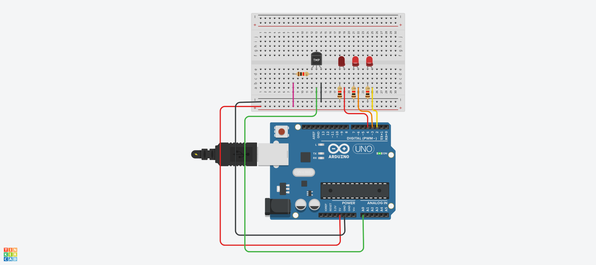
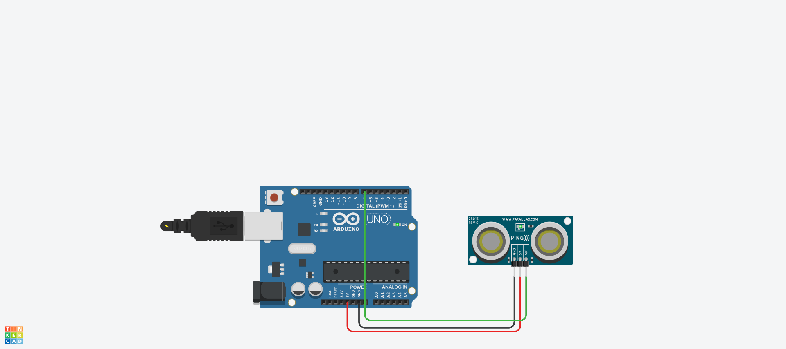
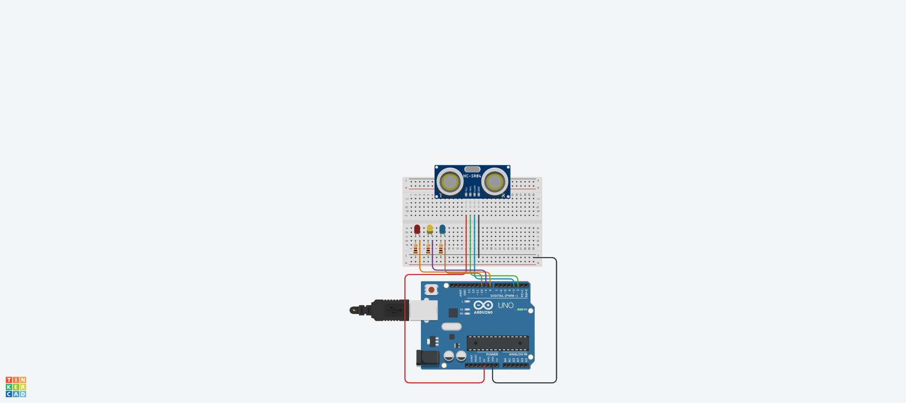
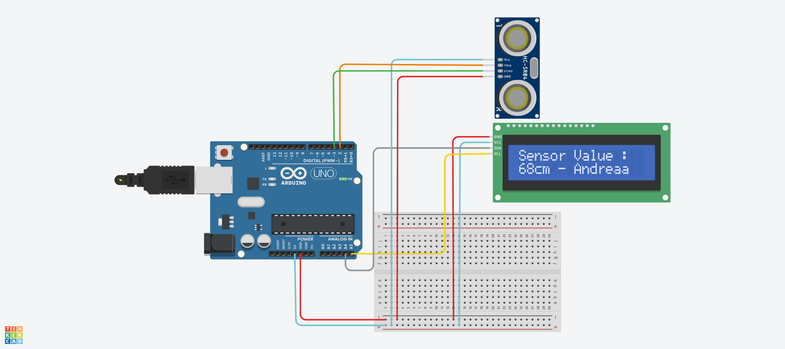
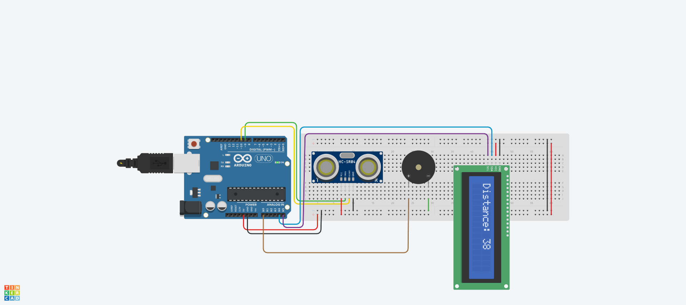

# 멜로디 예제 1
## tone() 함수를 이용하여 ‘도레미파솔라시도’출력


##  tone() 함수를 이용한 Source code
```c
void setup() {
  pinMode(7, OUTPUT);  // 디지털 핀 7번을 출력 모드로 설정 (스피커 연결용)
}

void loop(){
  tone(7, 262, 1000); // 7번 핀에서 262Hz 음을 1000ms(1초) 동안 재생 (도 음)
  delay(500);         // 0.5초 대기 (음이 끝나기 전에 약간 쉬는 시간)
  
  tone(7, 294, 1000); // 294Hz 음 재생 (레 음)
  delay(500);
  
  tone(7, 330, 1000); // 330Hz 음 재생 (미 음)
  delay(500);
  
  tone(7, 349, 1000); // 349Hz 음 재생 (파 음)
  delay(500);
  
  tone(7, 392, 1000); // 392Hz 음 재생 (솔 음)
  delay(500);
  
  tone(7, 440, 1000); // 440Hz 음 재생 (라 음)
  delay(500);
  
  tone(7, 494, 1000); // 494Hz 음 재생 (시 음)
  delay(500);
}
```
## 긴 악보의 연주곡
```c
const int piezo = 7;  // 부저(피에조) 연결 핀 번호

// 음계 코드 배열 (도, 레, 미, 파, 솔, 라, 시)
char code[] = {'C', 'D', 'E', 'F', 'G', 'A', 'B'};

// 각 음계에 해당하는 주파수 배열 (Hz 단위)
unsigned int freq[] = {262, 294, 330, 349, 392, 440, 494};

// 연주할 멜로디 데이터 (문자열)
// 'p'는 쉼표(rest)를 의미함
char mData[] = "CCGGAAGpFFEEDCCpGGFFEEDpGGFFEEDpCCGGAAGpFFEEDDCp";

// 멜로디 데이터 크기 (바이트 수)
const byte mSize = sizeof(mData);

void setup() {
   pinMode(piezo, OUTPUT);  // 부저 핀을 출력으로 설정
}

void loop() {
  int playT = 200;  // 한 음을 재생하는 시간 (200ms)

  // 멜로디 데이터 배열을 처음부터 끝까지 반복
  for(int m=0; m<mSize; m++) {
    // 음계 코드 배열을 돌면서 현재 멜로디 문자가 어떤 음계인지 확인
    for(int k=0; k<7; k++) {
      if(mData[m] == code[k]) 
        tone(piezo, freq[k], playT);  // 해당 음계 주파수로 음 재생
    }
    delay(playT);  // 음 재생 시간만큼 대기
  }

  noTone(piezo);    // 모든 음 재생 후 부저 음 끄기
  delay(2000);      // 멜로디가 끝난 후 2초 휴식
}
```

## tone()함수 없이 멜로디 출력(학교 종이 땡땡땡)
```c
const int piezo = 7;  // 피에조 스피커 핀

// 도레미파솔라시도 주파수
#define NOTE_C4  262
#define NOTE_D4  294
#define NOTE_E4  330
#define NOTE_F4  349
#define NOTE_G4  392
#define NOTE_A4  440
#define NOTE_B4  494
#define NOTE_C5  523

// 멜로디 배열 (학교 종이 땡땡땡)
int melody[] = {
  NOTE_C4, NOTE_C4, NOTE_G4, NOTE_G4, NOTE_A4, NOTE_A4, NOTE_G4, 0,
  NOTE_F4, NOTE_F4, NOTE_E4, NOTE_E4, NOTE_D4, NOTE_D4, NOTE_C4, 0,
  NOTE_G4, NOTE_G4, NOTE_F4, NOTE_F4, NOTE_E4, NOTE_E4, NOTE_D4, 0,
  NOTE_G4, NOTE_G4, NOTE_F4, NOTE_F4, NOTE_E4, NOTE_E4, NOTE_D4, 0,
  NOTE_C4, NOTE_C4, NOTE_G4, NOTE_G4, NOTE_A4, NOTE_A4, NOTE_G4, 0,
  NOTE_F4, NOTE_F4, NOTE_E4, NOTE_E4, NOTE_D4, NOTE_D4, NOTE_C4, 0
};

int noteDurations[] = {
  400, 400, 400, 400, 400, 400, 600, 200,
  400, 400, 400, 400, 400, 400, 600, 200,
  400, 400, 400, 400, 400, 400, 600, 200,
  400, 400, 400, 400, 400, 400, 600, 200,
  400, 400, 400, 400, 400, 400, 600, 200,
  400, 400, 400, 400, 400, 400, 600, 200
};

// 음을 직접 재생하는 함수 (tone 없이)
void playNote(int pin, unsigned int frequency, int duration) {
  if (frequency == 0) {
    delay(duration);  // 쉼표
    return;
  }

  unsigned long period = 1000000L / frequency;
  unsigned long cycles = (duration * 1000L) / period;

  for (unsigned long i = 0; i < cycles; i++) {
    digitalWrite(pin, HIGH);
    delayMicroseconds(period / 2);
    digitalWrite(pin, LOW);
    delayMicroseconds(period / 2);
  }
}

void setup() {
  pinMode(piezo, OUTPUT);
}

void loop() {
  int notes = sizeof(melody) / sizeof(melody[0]);

  for (int i = 0; i < notes; i++) {
    int freq = melody[i];
    int dur = noteDurations[i];

    playNote(piezo, freq, dur);
    delay(50); // 음 사이 쉼
  }

  delay(3000); // 한 곡 끝난 후 대기
}

```
## I2C LCD를 이용한 문자열 출력

```c
#include <Adafruit_LiquidCrystal.h>  // Adafruit LCD 라이브러리 포함

int seconds = 0;  // 초를 저장할 변수

Adafruit_LiquidCrystal lcd_1(0); // LCD 객체 생성 (I2C 주소 0번)

void setup()
{
  lcd_1.begin(16, 2);  // LCD를 16열 2행으로 초기화

  lcd_1.print("hello world");  // LCD 첫 줄에 "hello world" 출력
}

void loop()
{
  lcd_1.setCursor(0, 1);    // 커서를 두 번째 줄 첫 번째 칸으로 이동
  lcd_1.print(seconds);     // 현재 초(seconds) 값을 출력

  lcd_1.setBacklight(1);    // LCD 백라이트 켜기
  delay(500);               // 0.5초 대기

  lcd_1.setBacklight(0);    // LCD 백라이트 끄기
  delay(500);               // 0.5초 대기

  seconds += 1;             // 초 변수 1 증가
}
```
```C
#include <Wire.h>
#include <LiquidCrystal_I2C.h>


LiquidCrystal_I2C lcd(0x27, 16, 2);

void setup()
{
  lcd.init(); //LCD 초기화
  lcd.backlight();  //백라이트 켜기
  lcd.print("Hello, I2C");
}

void loop()
{
}
```
### 깜빡임 포함
```C
#include <Wire.h>
#include <LiquidCrystal_I2C.h>


LiquidCrystal_I2C lcd(0x27, 16, 2);

void setup()
{
  lcd.init(); //LCD 초기화
  lcd.backlight();  //백라이트 켜기
  lcd.print("Hello, I2C");
}

void loop()
{
  lcd.setCursor(0, 1);
  //lcd.print("Blinking LCD");

  lcd.backlight();       // 백라이트 켜기
  delay(500);

  lcd.noBacklight();     // 백라이트 끄기
  delay(500);
}
```
## 스위치를 많이 눌러라 게임

### Thinkercad
```c
#include <Adafruit_LiquidCrystal.h>  // Adafruit LCD 라이브러리 포함

// 버튼 핀 번호 정의
#define BUTTON_1P 10        // 1P 버튼 핀
#define BUTTON_2P 9         // 2P 버튼 핀
#define BUTTON_START 8      // 시작 버튼 핀

Adafruit_LiquidCrystal lcd(0);  // LCD 객체 생성 (I2C 주소 0번)

unsigned int buttonCnt1 = 0;    // 1P 버튼 누른 횟수 카운터
unsigned int buttonCnt2 = 0;    // 2P 버튼 누른 횟수 카운터

unsigned long currTime = 0;     // 현재 시간 (밀리초 단위)
unsigned long prevTime = 0;     // 이전 시간 저장용 변수

unsigned int gameTime = 30;     // 게임 시간 (초 단위), 초기값 30초

void setup() {
  // 버튼 핀을 내부 풀업 저항을 사용해 입력으로 설정
  pinMode(BUTTON_1P, INPUT_PULLUP);
  pinMode(BUTTON_2P, INPUT_PULLUP);
  pinMode(BUTTON_START, INPUT_PULLUP);

  lcd.begin(16, 2);  // LCD 16x2 문자 모드로 초기화
}

void loop() {
  // 1P 버튼 눌림 감지
  if(button1P() == 1) {
    if(gameTime > 0) buttonCnt1++;  // 게임 시간이 남아있으면 1P 카운터 증가
    delay(50);                      // 버튼 디바운싱용 짧은 딜레이
  }

  // 2P 버튼 눌림 감지
  if(button2P() == 1) {
    if(gameTime > 0) buttonCnt2++;  // 게임 시간이 남아있으면 2P 카운터 증가
    delay(50);                      // 버튼 디바운싱용 짧은 딜레이
  }

  // 시작 버튼 눌림 감지
  if(buttonStart() == 1) {
    gameTime = 30;          // 게임 시간 30초로 초기화
    buttonCnt1 = 0;         // 1P 카운터 초기화
    buttonCnt2 = 0;         // 2P 카운터 초기화
    delay(50);              // 버튼 디바운싱용 딜레이
  }

  currTime = millis();       // 현재 시간 읽기 (밀리초)
  
  // 1초가 지났으면 (1000ms)
  if(currTime - prevTime >= 1000) {
    prevTime = currTime;     // 이전 시간 갱신
    
    if(gameTime > 0) gameTime--;  // 게임 시간이 남아있으면 1초 감소
    
    lcd.clear();             // LCD 화면 초기화
    
    lcd.setCursor(3, 0);     // 첫 줄 4번째 칸으로 커서 이동
    lcd.print(" TIME: ");    // " TIME: " 출력
    lcd.print(gameTime);     // 남은 시간 출력
    
    lcd.setCursor(0, 1);     // 두 번째 줄 첫 칸으로 커서 이동
    lcd.print(" 1P: ");      // 1P 레이블 출력
    lcd.print(buttonCnt1);   // 1P 버튼 누른 횟수 출력
    
    lcd.setCursor(8, 1);     // 두 번째 줄 9번째 칸으로 커서 이동
    lcd.print(" 2P: ");      // 2P 레이블 출력
    lcd.print(buttonCnt2);   // 2P 버튼 누른 횟수 출력
  }
}

// 1P 버튼 눌림 감지 함수 (변화 감지 후 눌림 상태 확인)
int button1P() {
  static int oldSw = 1;  // 이전 버튼 상태 저장 (초기값 HIGH)
  static int newSw = 1;  // 현재 버튼 상태 저장
  newSw = digitalRead(BUTTON_1P);  // 버튼 핀 상태 읽기
  
  // 상태가 변했을 때
  if (newSw != oldSw) {
    oldSw = newSw;      // 이전 상태 갱신
    if(newSw == 0) {    // 버튼이 눌린 상태이면 (LOW)
      return 1;         // 눌림 신호 반환
    }
  }
  return 0;             // 눌리지 않음
}

// 2P 버튼 눌림 감지 함수 (변화 감지 후 눌림 상태 확인)
int button2P() {
  static int oldSw = 1;
  static int newSw = 1;
  newSw = digitalRead(BUTTON_2P);
  
  if (newSw != oldSw) {
    oldSw = newSw;
    if(newSw == 0) {
      return 1;
    }
  }
  return 0;
}

// 시작 버튼 눌림 감지 함수 (변화 감지 후 눌림 상태 확인)
int buttonStart() {
  static int oldSw = 1;
  static int newSw = 1;
  newSw = digitalRead(BUTTON_START);
  
  if (newSw != oldSw) {
    oldSw = newSw;
    if(newSw == 0) {
      return 1;
    }
  }
  return 0;
}
```
### 아두이노
```c
#include <LiquidCrystal_I2C.h>

#define BUTTON_1P 10
#define BUTTON_2P 9
#define BUTTON_START 8

LiquidCrystal_I2C lcd(0x27, 16, 2);

unsigned int buttonCnt1 = 0;
unsigned int buttonCnt2 = 0;

unsigned long currTime = 0;
unsigned long prevTime = 0;

unsigned int gameTime = 30;

void setup() {
  lcd.init();
  pinMode(BUTTON_1P, INPUT_PULLUP);
  pinMode(BUTTON_2P, INPUT_PULLUP);
  pinMode(BUTTON_START, INPUT_PULLUP);
  lcd.begin(16, 2);
}

void loop() {
  if (button1P() == 1) {
    if (gameTime > 0) buttonCnt1++;
    delay(50);
  }
  if (button2P() == 1) {
    if (gameTime > 0) buttonCnt2++;
    delay(50);
  }
  if (buttonStart() == 1) {
    gameTime = 30;
    buttonCnt1 = 0;
    buttonCnt2 = 0;
    delay(50);
  }

  currTime = millis();
  if (currTime - prevTime >= 1000) {
    prevTime = currTime;
    if (gameTime > 0) gameTime--;
    lcd.clear();
    lcd.setCursor(3, 0);
    lcd.print(" TIME: ");
    lcd.print(gameTime);
    lcd.setCursor(0, 1);
    lcd.print(" 1P: ");
    lcd.print(buttonCnt1);
    lcd.setCursor(8, 1);
    lcd.print(" 2P: ");
    lcd.print(buttonCnt2);
  }
}
int button1P() {
  static int oldSw = 1;
  static int newSw = 1;
  newSw = digitalRead(BUTTON_1P);
  if (newSw != oldSw) {
    oldSw = newSw;
    if (newSw == 0) {
      return 1;
    }
  }
  return 0;
}
int button2P() {
  static int oldSw = 1;
  static int newSw = 1;
  newSw = digitalRead(BUTTON_2P);
  if (newSw != oldSw) {
    oldSw = newSw;
    if (newSw == 0) {
      return 1;
    }
  }
  return 0;
}
int buttonStart() {
  static int oldSw = 1;
  static int newSw = 1;
  newSw = digitalRead(BUTTON_START);
  if (newSw != oldSw) {
    oldSw = newSw;
    if (newSw == 0) {
      return 1;
    }
  }
  return 0;
}
```
## 포토 레지스터 : 빛 센서(CDS)

```c
void setup()
{
  pinMode(9, OUTPUT); 
}

void loop()
{
  int val1 = analogRead(0);
  int val2 = map(val1, 0, 1023, 0, 255);
  
  analogWrite(9, val2);
  delay(20);
}
```

```c
int sensorValue = 0;

void setup()
{
  pinMode(A0, INPUT);
  Serial.begin(9600);
  pinMode(9, OUTPUT);
}

void loop()
{
  // read the value from the sensor
  sensorValue = analogRead(A0);
  // print the sensor reading so you know its range
  Serial.println(sensorValue);
  // map the sensor reading to a range for the LED
  analogWrite(9, map(sensorValue, 0, 1023, 0, 255));
  delay(100); // Wait for 100 millisecond(s)
}
```

```c
int sensorPin = A0;  //아날로그 핀은 입력 명시하지 않아도 됨.
int ledPin = 9;  // PWM
int lightLevel;


void setup()
{
    pinMode(ledPin, OUTPUT); 
}


void loop()
{
    lightLevel = analogRead(sensorPin); 
    adjustBrightness(); //LED 밝기 조절 함수
    analogWrite(ledPin, lightLevel); 
}


void adjustBrightness()
{
    lightLevel = map(lightLevel, 500, 1023, 0, 255);
    lightLevel = constrain(lightLevel, 0, 255);
      //lightlevel이 0보다 작으면 0을 출력 
      //255보다 크면 255를 출력, 0~255사이의 숫자면 그대로 출력
}
```

## 온도 센서 : TMP36 - 1

```c
int baselineTemp = 0;    // 기준 온도 설정 변수

int celsius = 0;         // 섭씨 온도 저장 변수

int fahrenheit = 0;      // 화씨 온도 저장 변수

void setup()
{
  pinMode(A0, INPUT);    // 아날로그 입력 A0핀을 입력 모드로 설정 (온도 센서 연결)
  Serial.begin(9600);    // 시리얼 통신 9600bps로 시작
  pinMode(2, OUTPUT);    // LED 제어용 핀 2 출력 모드 설정
  pinMode(3, OUTPUT);    // LED 제어용 핀 3 출력 모드 설정
  pinMode(4, OUTPUT);    // LED 제어용 핀 4 출력 모드 설정
}

void loop()
{
  // LED 작동 기준 온도 설정
  baselineTemp = 40;

  // 온도를 섭씨로 측정
  // analogRead(A0)에서 읽은 값을 보정 후 3.04 곱해서 0~1023 범위를 -40~125도 범위로 맵핑
  celsius = map(((analogRead(A0) - 20) * 3.04), 0, 1023, -40, 125);

  // 섭씨를 화씨로 변환 공식 적용
  fahrenheit = ((celsius * 9) / 5 + 32);

  // 측정된 온도 값을 시리얼 모니터에 출력
  Serial.print(celsius);
  Serial.print(" C, ");
  Serial.print(fahrenheit);
  Serial.println(" F");

  // 온도에 따른 LED 점등 제어
  if (celsius < baselineTemp) {
    // 기준 온도보다 낮으면 모든 LED 끄기
    digitalWrite(2, LOW);
    digitalWrite(3, LOW);
    digitalWrite(4, LOW);
  }
  if (celsius >= baselineTemp && celsius < baselineTemp + 10) {
    // 기준 온도 이상 10도 미만이면 LED 2만 켬
    digitalWrite(2, HIGH);
    digitalWrite(3, LOW);
    digitalWrite(4, LOW);
  }
  if (celsius >= baselineTemp + 10 && celsius < baselineTemp + 20) {
    // 기준 온도 +10 이상 20도 미만이면 LED 2, 3 켬
    digitalWrite(2, HIGH);
    digitalWrite(3, HIGH);
    digitalWrite(4, LOW);
  }
  if (celsius >= baselineTemp + 20 && celsius < baselineTemp + 30) {
    // 기준 온도 +20 이상 30도 미만이면 LED 2, 3, 4 모두 켬
    digitalWrite(2, HIGH);
    digitalWrite(3, HIGH);
    digitalWrite(4, HIGH);
  }
  if (celsius >= baselineTemp + 30) {
    // 기준 온도 +30 이상이면 LED 2, 3, 4 모두 켬 (최고 온도 상태)
    digitalWrite(2, HIGH);
    digitalWrite(3, HIGH);
    digitalWrite(4, HIGH);
  }

  delay(1000); // 1초간 대기 (측정 및 표시 간격)
}
```

## 초음파 센서(3pin)

```c
/* 3핀 초음파센서 활용 */
int ultra = 7; // 출력 단자

void setup(){
  Serial.begin(9600);
}
void loop(){
  pinMode(ultra, OUTPUT);  
  //sig핀 기본출력설정
  digitalWrite(ultra, LOW);
  delay(1); // Wait for 100 millisecond(s), 
  
  digitalWrite(ultra, HIGH);
  delayMicroseconds(10);//센서를 동작하기 위한 시작신호로
  // sig핀에 5us동안 high신호 출력후 low출력
  digitalWrite(ultra, LOW);
  
  pinMode(ultra, INPUT);  
  
  //ultra 핀이 HIGH를 유지한 시간을 저장
  unsigned long duration = pulseIn(ultra, HIGH);
  
  //HIGH였을땨 시간(초음파가 보냈다가 다시 돌아온 시간)을 가지고 거리계산
  //초음파는 340m/s속도로 이동함에 따라(25도씨 기준)
  //이때 속도와 센서가 보낸 시간을 이용하여 거리를 계산
  //왕복해서 오는것이므로 결과를 2로 나누어 줌
  double dist = ((340*duration)/10000)/2;
    
  Serial.print("Distance:  ");
  Serial.print(dist);
  Serial.println("cm");
  delay(100);
}
```

## 초음파 센서(4pin)

```c
/*거리에 따라 LED 표시*/

int trig = 2;          
int echo = 3;
int RED = 8;       
int YELLOW = 9;     
int GREEN = 10;    

void setup()
{
  Serial.begin(9600);
  pinMode(trig, OUTPUT);
  pinMode(echo, INPUT);
  pinMode(RED, OUTPUT);     
  pinMode(YELLOW, OUTPUT);
  pinMode(GREEN, OUTPUT);
}

void loop()
{
  digitalWrite(trig, HIGH);
  delayMicroseconds(10);
  digitalWrite(trig, LOW);

  // echoPin 이 HIGH를 유지한 시간을 저장 한다.
  unsigned long duration = pulseIn(echo, HIGH); 
  // HIGH 였을 때 시간(초음파가 보냈다가 다시 들어온 시간)을 가지고 거리를 계산 한다.
  float distance = ((float)(340 * duration) / 10000) / 2;  
  
  Serial.print(distance);
  Serial.println("cm");
  delay(100);
  
  if (distance > 80)  //   distance(거리) 가 80보다 크면
  {
    digitalWrite(GREEN, HIGH);     // GREEN이 연결된 핀에 HIGH 신호(5V)를,
    digitalWrite(YELLOW, LOW);    // YELLOW가 연결된 핀에 LOW 신호(0V)를,
    digitalWrite(RED, LOW);       // RED가 연결된 핀에 LOW신호(0V)를.
  }
  if (distance > 30 & distance <= 70)  
  {
    digitalWrite(GREEN, LOW);   
    digitalWrite(YELLOW, HIGH);
    digitalWrite(RED, LOW);
  }
  if (distance > 0 & distance <= 30)
  {
    digitalWrite(GREEN, LOW);
    digitalWrite(YELLOW, LOW);
    digitalWrite(RED, HIGH);
  }
}
```
## Ultrasonic sensor and 12C LCD

```c
#include <Adafruit_LiquidCrystal.h>

#define trigPin 2    // 초음파 센서의 트리거 핀 번호 정의
#define echoPin 3    // 초음파 센서의 에코 핀 번호 정의

long duration;       // 초음파 신호가 왕복하는 데 걸린 시간(마이크로초)
int distance;        // 계산된 거리(cm)

Adafruit_LiquidCrystal lcd_1(0);  // LCD 객체 생성 (I2C 주소 0)

void setup() {
  pinMode(trigPin, OUTPUT);   // 트리거 핀을 출력 모드로 설정
  pinMode(echoPin, INPUT);    // 에코 핀을 입력 모드로 설정
  Serial.begin(9600);         // 시리얼 통신 시작 (디버깅용)
  lcd_1.begin(16,2);          // LCD 초기화 (16x2 크기)
  lcd_1.print("Sensor Value :");  // LCD 첫 줄에 텍스트 출력
}

void loop() {
  // 초음파 센서에 신호 보내기
  digitalWrite(trigPin, LOW);
  delayMicroseconds(5);       // 잠시 대기
  digitalWrite(trigPin, HIGH);
  delayMicroseconds(10);      // 10마이크로초 동안 HIGH 신호 유지
  digitalWrite(trigPin, LOW);

  // 에코 핀에서 신호가 HIGH인 시간 측정
  duration = pulseIn(echoPin, HIGH);

  // 시간(duration)을 거리(cm)로 변환 (음속 340m/s 기준)
  distance = duration * 0.034 / 2;

  // LCD 두 번째 줄에 거리 출력
  lcd_1.setCursor(0,1);
  lcd_1.print(distance);
  lcd_1.print("cm - Andrea");

  delay(50);  // 50밀리초 대기 후 다시 측정
}
```

## Ultrasonic sensor with LCD and Buzzer - 2

```c
// C++ 코드
//
#include <Adafruit_LiquidCrystal.h>

Adafruit_LiquidCrystal lcd(0);  // LCD 객체 생성 (I2C 주소 0)

// 초음파 센서 핀 정의
const int trigPin = 9;
const int echoPin = 10;

// 버저 핀 정의
const int buzzerPin = A0;

void setup() {
  Serial.begin(9600);
  lcd.begin(16,2);               // LCD 초기화 (16x2 크기)
  lcd.setCursor(0,0);
  lcd.print("Initializing...");  // 초기화 메시지 출력

  pinMode(trigPin, OUTPUT);      // 트리거 핀 출력 모드 설정
  pinMode(echoPin, INPUT);       // 에코 핀 입력 모드 설정
  pinMode(buzzerPin, OUTPUT);    // 버저 핀 출력 모드 설정
  
  delay(2000);                   // 2초 대기
  lcd.clear();
  lcd.print("Ready");            // 준비 완료 메시지 출력
  delay(1000);
}

void loop() {
  long duration, distance;
  
  // 초음파 신호 보내기
  digitalWrite(trigPin, LOW);
  delayMicroseconds(2);
  digitalWrite(trigPin, HIGH);
  delayMicroseconds(10);
  digitalWrite(trigPin, LOW);
  
  // 에코 핀에서 신호가 HIGH인 시간 측정
  duration = pulseIn(echoPin, HIGH); 
  
  // 시간(duration)을 거리(cm)로 변환 (음속 340m/s 기준)
  distance = duration * 0.034 / 2; 

  lcd.clear();
  lcd.setCursor(0, 0);
  lcd.print("Distance: ");       // 거리 표시 텍스트 출력

  if (distance >= 70 || distance <= 0) {   // 거리 측정 범위 밖일 때
    lcd.print("Out of range");              // 범위 밖 메시지 출력
    noTone(buzzerPin);                      // 버저 소리 끄기
  } else {
    lcd.print(distance);                    // 측정된 거리 출력
    lcd.print(" cm");

    // 거리별 버저 소리 제어
    if (distance > 60) {
      tone(buzzerPin, 2500); // 60cm 초과 시 2500Hz 소리 재생
    } else if (distance > 20) {
      tone(buzzerPin, 1500); // 20~60cm 사이 1500Hz 소리 재생
    } else if (distance > 1) {
      tone(buzzerPin, 500);  // 1~20cm 사이 500Hz 소리 재생
    }
  }

  delay(500);  // 0.5초 대기
}
```
