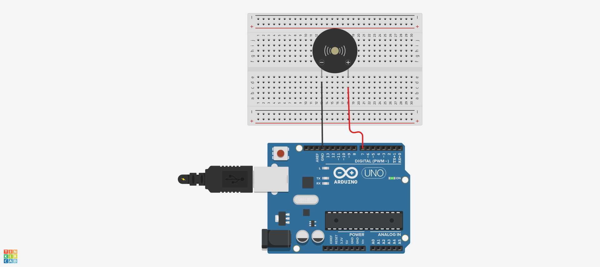

# 멜로디 예제 1
## tone() 함수를 이용하여 ‘도레미파솔라시도’출력


##  tone() 함수를 이용한 Source code
```c
void setup() {
  pinMode(7, OUTPUT);
}

void loop(){
  tone(7, 262, 1000);
  delay(500);
  tone(7, 294, 1000);
  delay(500);
  tone(7, 330, 1000);
  delay(500);
  tone(7, 349, 1000);
  delay(500);
  tone(7, 392, 1000);
  delay(500);
  tone(7, 440, 1000);
  delay(500);
  tone(7, 494, 1000);
  delay(500);
}
```

