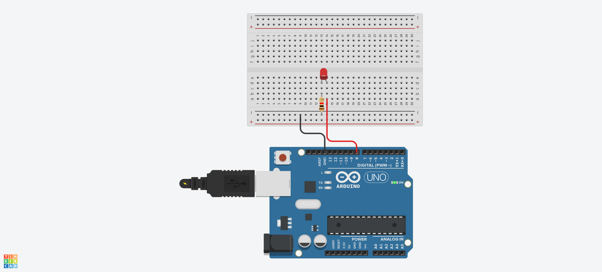

# LED 예제 1
## LED 깜박이기


## LED 깜박이기 Source code

```c
#define LED_BUILTIN 8

void setup() {
  // initialize digital pin LED_BUILTIN as an output.
  pinMode(LED_BUILTIN, OUTPUT);
}

// the loop function runs over and over again forever
void loop() {
  digitalWrite(LED_BUILTIN, HIGH);  // turn the LED on (HIGH is the voltage level)
  delay(1000);                      // wait for a second
  digitalWrite(LED_BUILTIN, LOW);   // turn the LED off by making the voltage LOW
  delay(1000);                      // wait for a second
}
```
## a와 b로 LED 켜고 끄기
```C
void setup()
{
  Serial.begin(9600);
  pinMode(8, OUTPUT);
}

void loop()
{
  if(Serial.available()>0)
  {
    char sData = Serial.read();
    if(sData == 'a')
    {
      digitalWrite(8, HIGH);
    }
    else if(sData == 'b')
    {
      digitalWrite(8, LOW);
    }
  }
}
```
