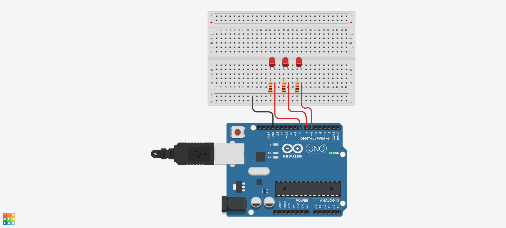
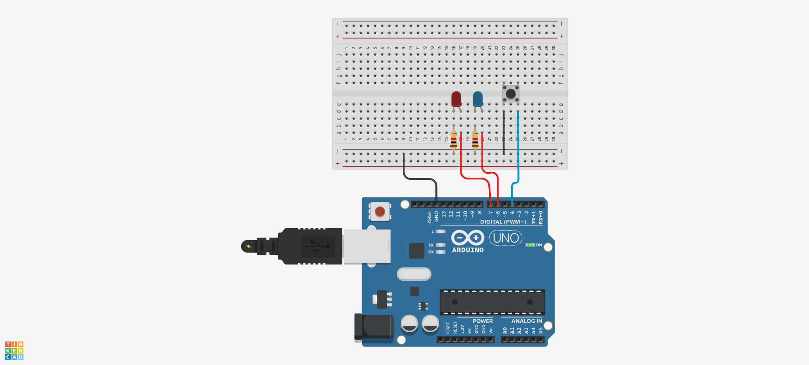

# LED 예제 1
## LED 깜박이기


## LED 깜박이기 Source code

```c
#define LED_BUILTIN 8

void setup() {
  // initialize digital pin LED_BUILTIN as an output.
  pinMode(LED_BUILTIN, OUTPUT);
}

// the loop function runs over and over again forever
void loop() {
  digitalWrite(LED_BUILTIN, HIGH);  // turn the LED on (HIGH is the voltage level)
  delay(1000);                      // wait for a second
  digitalWrite(LED_BUILTIN, LOW);   // turn the LED off by making the voltage LOW
  delay(1000);                      // wait for a second
}
```
## a와 b로 LED 켜고 끄기
```C
void setup()
{
  Serial.begin(9600);
  pinMode(8, OUTPUT);
}

void loop()
{
  if(Serial.available()>0)
  {
    char sData = Serial.read();
    if(sData == 'a')
    {
      digitalWrite(8, HIGH);
    }
    else if(sData == 'b')
    {
      digitalWrite(8, LOW);
    }
  }
}
```
## 3개의 LED 깜박이기


```C
#define LED1 8
#define LED2 7
#define LED3 6

void setup()
{
  pinMode(LED1, OUTPUT);
  pinMode(LED2, OUTPUT);
  pinMode(LED3, OUTPUT);
}

void loop()
{
  digitalWrite(LED1, HIGH);
  digitalWrite(LED2, HIGH);
  digitalWrite(LED3, HIGH);
  delay(1000);
  digitalWrite(LED1, LOW);
  digitalWrite(LED2, LOW);
  digitalWrite(LED3, LOW);
  delay(1000);
}
```
## 버튼으로 LED 깜박이기


```c
#define BUTTON 4
#define LED_BLUE 6
#define LED_RED 7
#define DELAY_TIME 80

int state = 0;

void setup()
{
  Serial.begin(9600); // 시리얼 통신 시작 (디버깅용)
  pinMode(BUTTON, INPUT_PULLUP); // 버튼을 내부 풀업으로 설정
  pinMode(LED_BLUE, OUTPUT);
  pinMode(LED_RED, OUTPUT);
}

void loop()
{
  int buttonValue = !digitalRead(BUTTON); // 버튼 눌림 여부 감지
  
  if(buttonValue == 1)
  {
    state = !state; // 상태 토글: 0 → 1 또는 1 → 0
    delay(500);
  }
  
  if(state == 0)
  {
    digitalWrite(LED_BLUE, HIGH);
    digitalWrite(LED_RED, LOW);
    delay(DELAY_TIME);
    digitalWrite(LED_RED, HIGH);
    digitalWrite(LED_BLUE, LOW);
    delay(DELAY_TIME);
  }
  else if(state == 1)
  {
    digitalWrite(LED_BLUE, LOW);
    digitalWrite(LED_RED, LOW);
  }
}
```
