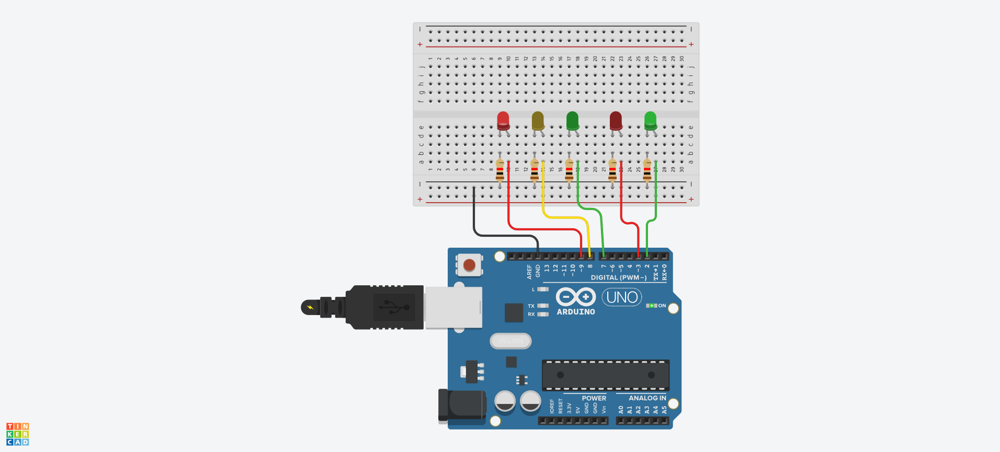
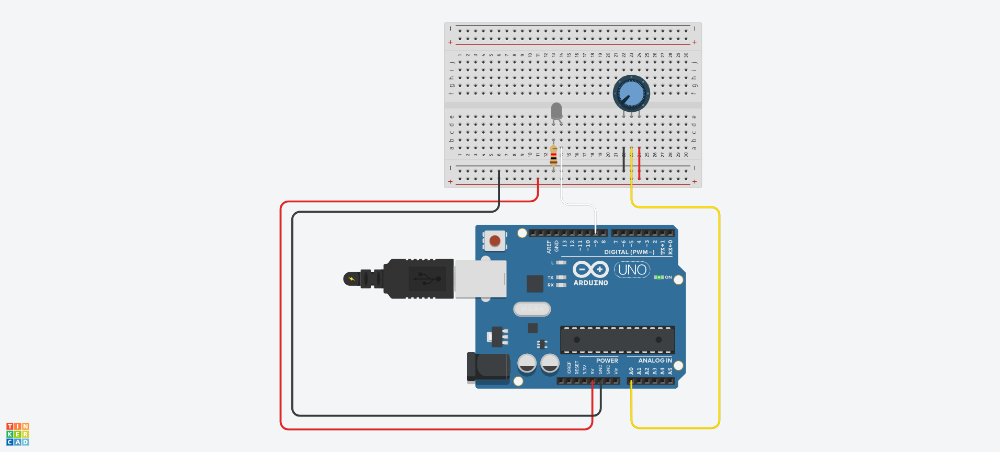
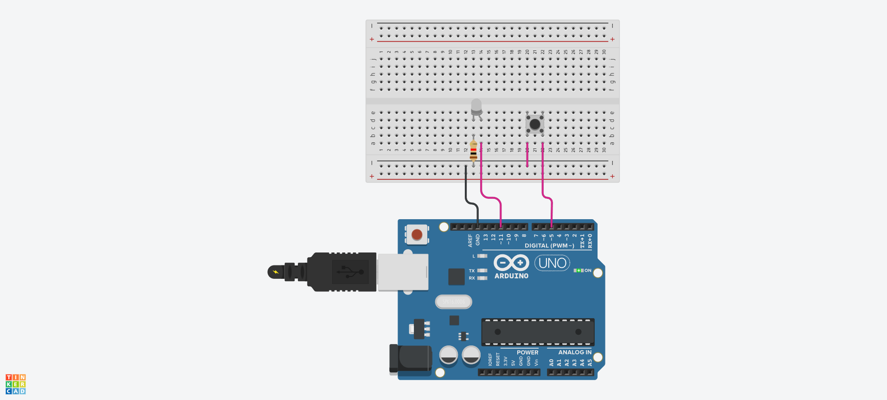

# LED 예제 1
## LED 깜박이기


## LED 깜박이기 Source code

```c
// LED가 연결된 핀 번호를 정의 (여기서는 디지털 핀 8번 사용)
#define LED_BUILTIN 8

void setup() {
  // LED_BUILTIN 핀을 출력 모드로 설정
  pinMode(LED_BUILTIN, OUTPUT);
}

void loop() {
  // LED를 켬 (HIGH: 핀에 전압을 인가)
  digitalWrite(LED_BUILTIN, HIGH);
  delay(1000);  // 1초 대기

  // LED를 끔 (LOW: 핀의 전압을 0으로 설정)
  digitalWrite(LED_BUILTIN, LOW);
  delay(1000);  // 1초 대기
}
```
## a와 b로 LED 켜고 끄기
```C
void setup()
{
  Serial.begin(9600);     // 시리얼 통신 시작 (속도: 9600bps)
  pinMode(8, OUTPUT);     // 디지털 핀 8번을 출력 모드로 설정 (LED 등 제어용)
}

void loop()
{
  // 시리얼로 들어온 데이터가 있을 경우 실행
  if (Serial.available() > 0)
  {
    char sData = Serial.read();  // 시리얼로 들어온 1바이트 문자 읽기

    if (sData == 'a')            // 받은 문자가 'a'일 경우
    {
      digitalWrite(8, HIGH);     // 8번 핀에 전압 출력 → LED 켜기
    }
    else if (sData == 'b')       // 받은 문자가 'b'일 경우
    {
      digitalWrite(8, LOW);      // 8번 핀 전압 끄기 → LED 끄기
    }
  }
}
```
## 3개의 LED 깜박이기


```C
// LED 핀 번호를 정의
#define LED1 8   // 첫 번째 LED는 디지털 핀 8번에 연결
#define LED2 7   // 두 번째 LED는 디지털 핀 7번에 연결
#define LED3 6   // 세 번째 LED는 디지털 핀 6번에 연결

void setup()
{
  // LED 핀들을 출력 모드로 설정
  pinMode(LED1, OUTPUT);
  pinMode(LED2, OUTPUT);
  pinMode(LED3, OUTPUT);
}

void loop()
{
  // 모든 LED를 켬
  digitalWrite(LED1, HIGH);
  digitalWrite(LED2, HIGH);
  digitalWrite(LED3, HIGH);
  delay(1000);  // 1초 동안 유지

  // 모든 LED를 끔
  digitalWrite(LED1, LOW);
  digitalWrite(LED2, LOW);
  digitalWrite(LED3, LOW);
  delay(1000);  // 1초 동안 유지
}
```
## 버튼으로 LED 깜박이기


```c
#define BUTTON 4
#define LED_BLUE 6
#define LED_RED 7
#define DELAY_TIME 80

int state = 0;

void setup()
{
  Serial.begin(9600); // 시리얼 통신 시작 (디버깅용)
  pinMode(BUTTON, INPUT_PULLUP); // 버튼을 내부 풀업으로 설정
  pinMode(LED_BLUE, OUTPUT);
  pinMode(LED_RED, OUTPUT);
}

void loop()
{
  int buttonValue = !digitalRead(BUTTON); // 버튼 눌림 여부 감지
  
  if(buttonValue == 1)
  {
    state = !state; // 상태 토글: 0 → 1 또는 1 → 0
    delay(500);
  }
  
  if(state == 0)
  {
    digitalWrite(LED_BLUE, HIGH);
    digitalWrite(LED_RED, LOW);
    delay(DELAY_TIME);
    digitalWrite(LED_RED, HIGH);
    digitalWrite(LED_BLUE, LOW);
    delay(DELAY_TIME);
  }
  else if(state == 1)
  {
    digitalWrite(LED_BLUE, LOW);
    digitalWrite(LED_RED, LOW);
  }
}
```
## LED를 이용한 신호등 구현하기

```c
// 자동차 신호등 LED 핀 정의
#define CAR_LED_RED 9       // 자동차용 빨간불 (정지)
#define CAR_LED_YELLOW 8    // 자동차용 노란불 (주의)
#define CAR_LED_GREEN 7     // 자동차용 초록불 (출발)

// 보행자 신호등 LED 핀 정의
#define HUMAN_LED_RED 3     // 보행자용 빨간불 (정지)
#define HUMAN_LED_GREEN 2   // 보행자용 초록불 (횡단 가능)

void setup() {
  // 모든 LED 핀을 출력으로 설정
  pinMode(CAR_LED_RED, OUTPUT);
  pinMode(CAR_LED_YELLOW, OUTPUT);
  pinMode(CAR_LED_GREEN, OUTPUT);
  pinMode(HUMAN_LED_RED, OUTPUT);
  pinMode(HUMAN_LED_GREEN, OUTPUT);
}

void loop() {
  // [자동차 초록불 / 보행자 빨간불] 상태 (자동차 출발, 보행자 대기)
  digitalWrite(CAR_LED_RED, LOW);
  digitalWrite(CAR_LED_YELLOW, LOW);
  digitalWrite(CAR_LED_GREEN, HIGH);
  digitalWrite(HUMAN_LED_RED, HIGH);
  digitalWrite(HUMAN_LED_GREEN, LOW);
  delay(5000); // 5초 유지

  // [자동차 노란불 / 보행자 빨간불] 상태 (자동차 감속 준비, 보행자 계속 대기)
  digitalWrite(CAR_LED_RED, LOW);
  digitalWrite(CAR_LED_YELLOW, HIGH);
  digitalWrite(CAR_LED_GREEN, LOW);
  digitalWrite(HUMAN_LED_RED, HIGH);
  digitalWrite(HUMAN_LED_GREEN, LOW);
  delay(5000); // 5초 유지

  // [자동차 빨간불 / 보행자 초록불] 상태 (자동차 정지, 보행자 건넌다)
  digitalWrite(CAR_LED_RED, HIGH);
  digitalWrite(CAR_LED_YELLOW, LOW);
  digitalWrite(CAR_LED_GREEN, LOW);
  digitalWrite(HUMAN_LED_RED, LOW);
  digitalWrite(HUMAN_LED_GREEN, HIGH);
  delay(2000); // 2초 동안 초록불 유지

  // 보행자 초록불 깜빡이기 (건너는 시간 종료 알림)
  digitalWrite(HUMAN_LED_GREEN, LOW);
  delay(500);
  digitalWrite(HUMAN_LED_GREEN, HIGH);
  delay(500);
  digitalWrite(HUMAN_LED_GREEN, LOW);
  delay(500);
  digitalWrite(HUMAN_LED_GREEN, HIGH);
  delay(500);
  digitalWrite(HUMAN_LED_GREEN, LOW);
  delay(500);
  digitalWrite(HUMAN_LED_GREEN, HIGH);
  delay(500);
}
```
## LED 스탠드 만들기_가변저항 사용

```c
// 핀 번호 정의
#define LED 9     // LED 또는 모터가 연결된 PWM 출력 핀
#define VR A0     // 가변저항(또는 센서)이 연결된 아날로그 입력 핀

void setup(){
  Serial.begin(9600);  // 시리얼 통신 시작 (9600bps)
}

void loop(){
  int analogValue = analogRead(VR);  // A0 핀에서 아날로그 값 읽기 (0~1023)
  
  // 읽은 아날로그 값을 PWM 출력 범위(0~255)로 변환
  int analogMapping = map(analogValue, 0, 1023, 0, 255);

  // 변환된 값을 LED 핀에 PWM 신호로 출력 (밝기 조절)
  analogWrite(LED, analogMapping);
}
```
## LED 스탠드 만들기_스위치 사용

```c
// 핀 번호 정의
#define SW_PIN 5       // 스위치가 연결된 디지털 핀 (입력용)
#define LED_PIN 11     // LED가 연결된 PWM 출력 핀

// 스위치 상태 변수
int newSwValue = 1;    // 현재 스위치 상태 저장 변수
int oldSwValue = 1;    // 이전 스위치 상태 저장 변수

int cnt = 0;           // 버튼 누른 횟수 (LED 밝기 단계 제어용)

void setup() {
  Serial.begin(9600);               // 시리얼 통신 시작 (속도: 9600bps)
  pinMode(SW_PIN, INPUT_PULLUP);    // 스위치 핀을 입력 풀업 모드로 설정
  // INPUT_PULLUP: 내부 풀업 저항을 사용해 디폴트로 HIGH 상태 유지
}

void loop() {
  newSwValue = digitalRead(SW_PIN); // 스위치의 현재 상태 읽기

  // 이전 상태와 현재 상태가 다르면 (즉, 변화가 있으면)
  if(newSwValue != oldSwValue) {
    oldSwValue = newSwValue;        // 이전 상태를 현재 상태로 갱신

    // 스위치가 눌렸을 때 (LOW 상태일 때)
    if(newSwValue == 0) {
      cnt++;                        // 버튼 누른 횟수 증가
      if(cnt >= 4) cnt = 0;         // 0~3까지 반복되도록 설정
      Serial.println(newSwValue);  // 시리얼 모니터에 상태 출력
    }
    delay(200); // 디바운싱 처리용 지연 (중복 입력 방지)
  }

  // 버튼 누른 횟수(cnt)에 따라 LED 밝기 설정
  if(cnt == 0) analogWrite(LED_PIN, 0);     // 꺼짐
  else if(cnt == 1) analogWrite(LED_PIN, 50);   // 약하게
  else if(cnt == 2) analogWrite(LED_PIN, 150);  // 중간 밝기
  else if(cnt == 3) analogWrite(LED_PIN, 255);  // 최대 밝기
}
```
## Reference
- 만들면서 배우는 아두이노와 40개의 작품들. 장문철, 앤써북

