# sensor예제
## DC Motor
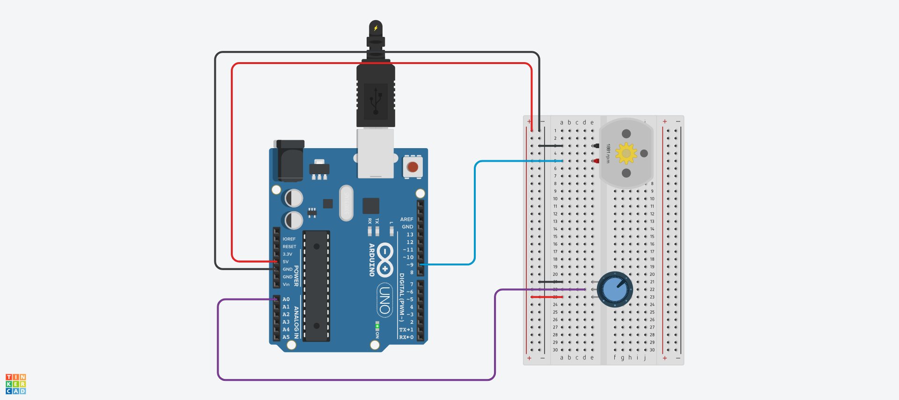
```c
void setup() 
{
  pinMode(9, OUTPUT);
}
void loop()
{
  Serial.begin(9600);
  int inputValue = analogRead(A0);
  Serial.println(inputValue);
  int convertedValue = map(inputValue, 0, 1023, 0, 255);

  analogWrite(9, convertedValue);
  delay(100);
}
```
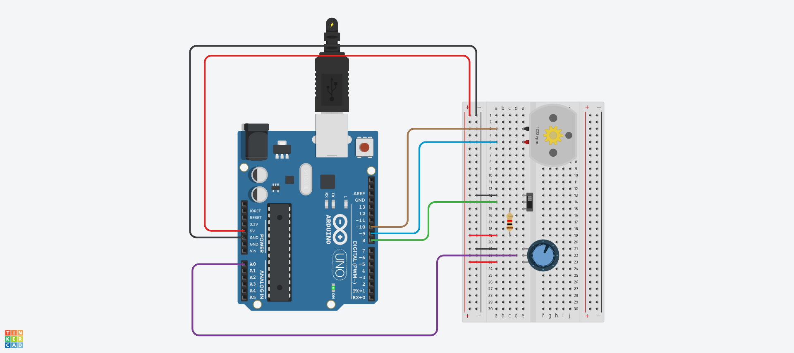
```c
void setup() 
{
  pinMode(9, OUTPUT);
  pinMode(10, OUTPUT);
  pinMode(8, INPUT_PULLUP); // 이 부분이 핵심
}
void loop()
{
  int inputValue = analogRead(A0);
  Serial.println(inputValue);
  int convertedValue = map(inputValue, 0, 1023, 0, 255);

  int inputSwitch = digitalRead(8);
  if(inputSwitch == LOW) {	
    analogWrite(9, convertedValue);  //정회전
    analogWrite(10, 0);
  }
  else {
    analogWrite(9, 0); //역회전
    analogWrite(10, convertedValue);
  }   
  delay(100);
}
```
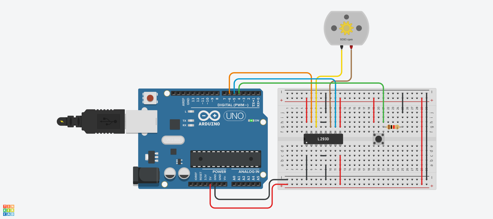
```c
const int MOTOR_PIN_A = 5;
const int MOTOR_PIN_B = 6;

void setup() 
{
  pinMode(MOTOR_PIN_A, OUTPUT);
  pinMode(MOTOR_PIN_B, OUTPUT);
}
void loop()
{
  int readValue = digitalRead(4);

  if(readValue == LOW) {	
    analogWrite(MOTOR_PIN_A, 255);
    analogWrite(MOTOR_PIN_B, 0);   // B측은 0 → 모터 한 방향 회전
  }
  else {
    analogWrite(MOTOR_PIN_A, 0);
    analogWrite(MOTOR_PIN_B, 255);  //반대방향
  }   
  delay(100);
}
```
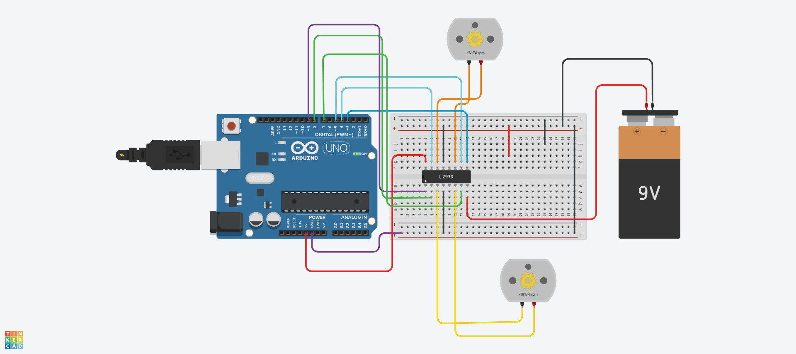
```c
// Motor A connections
int enA = 9;
int in1 = 8;
int in2 = 7;
// Motor B connections
int enB = 3;
int in3 = 5;
int in4 = 4;

void setup() {
	// Set all the motor control pins to outputs
	pinMode(enA, OUTPUT);
	pinMode(enB, OUTPUT);
	pinMode(in1, OUTPUT);
	pinMode(in2, OUTPUT);
	pinMode(in3, OUTPUT);
	pinMode(in4, OUTPUT);
	
	// Turn off motors - Initial state
	digitalWrite(in1, LOW);
	digitalWrite(in2, LOW);
	digitalWrite(in3, LOW);
	digitalWrite(in4, LOW);
}

void loop() {
	directionControl();
	delay(1000);
	speedControl();
	delay(1000);
}

// This function lets you control spinning direction of motors
void directionControl() {
	// Set motors to maximum speed
	// For PWM maximum possible values are 0 to 255
	analogWrite(enA, 255);
	analogWrite(enB, 255);

	// Turn on motor A & B
	digitalWrite(in1, HIGH);
	digitalWrite(in2, LOW);
	digitalWrite(in3, HIGH);
	digitalWrite(in4, LOW);
	delay(2000);
	
	// Now change motor directions
	digitalWrite(in1, LOW);
	digitalWrite(in2, HIGH);
	digitalWrite(in3, LOW);
	digitalWrite(in4, HIGH);
	delay(2000);
	
	// Turn off motors
	digitalWrite(in1, LOW);
	digitalWrite(in2, LOW);
	digitalWrite(in3, LOW);
	digitalWrite(in4, LOW);
}

// This function lets you control speed of the motors
void speedControl() {
	// Turn on motors 방향설정
	digitalWrite(in1, LOW);
	digitalWrite(in2, HIGH);
	digitalWrite(in3, LOW);
	digitalWrite(in4, HIGH);
	
	// 가속
	for (int i = 0; i < 256; i++) {
		analogWrite(enA, i);
		analogWrite(enB, i);
		delay(20);
	}
	
	// 감속
	for (int i = 255; i >= 0; --i) {
		analogWrite(enA, i);
		analogWrite(enB, i);
		delay(20);
	}
	
	// 정지
	digitalWrite(in1, LOW);
	digitalWrite(in2, LOW);
	digitalWrite(in3, LOW);
	digitalWrite(in4, LOW);
}
```
## DC Motor with Encoder
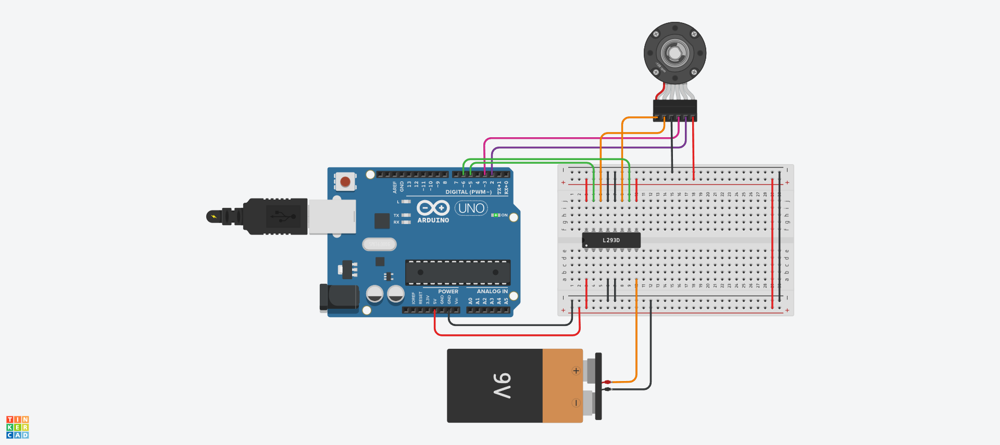
```c
#include <Encoder.h>           // 엔코더 라이브러리 포함

Encoder encoder(2, 3);         // 핀 2, 3번에 엔코더 연결 (UNO에서는 반드시 2, 3 사용)

long position = 0;             // 현재 모터 위치 (10스텝 당 1회전이라고 가정)
int rotation = 0;              // 회전 수 저장 변수

void setup()
{
  Serial.begin(9600);          // 시리얼 통신 시작 (9600bps)
  
  pinMode(5, OUTPUT);          // 모터 제어 핀 5번을 출력으로 설정
  pinMode(6, OUTPUT);          // 모터 제어 핀 6번을 출력으로 설정
}

void loop()
{
  // 모터를 한 방향으로 회전 (5번 핀에 PWM 신호, 6번 핀 LOW)
  analogWrite(5, 30);          // 모터에 30/255 속도로 회전 명령
  analogWrite(6, 0);

  // 엔코더에서 현재 위치값을 읽고 10으로 나눠 위치 단순화
  position = encoder.read() / 10;

  // 회전 수 계산 (절대값 사용, 10 스텝 = 1회전으로 가정)
  rotation = abs(position) / 10;

  // 현재 위치 출력
  Serial.print("pos: ");
  Serial.println(position);

  // 현재까지의 회전 수 출력
  Serial.print("rot: ");
  Serial.println(rotation);
}

```
## Vibrator Motor
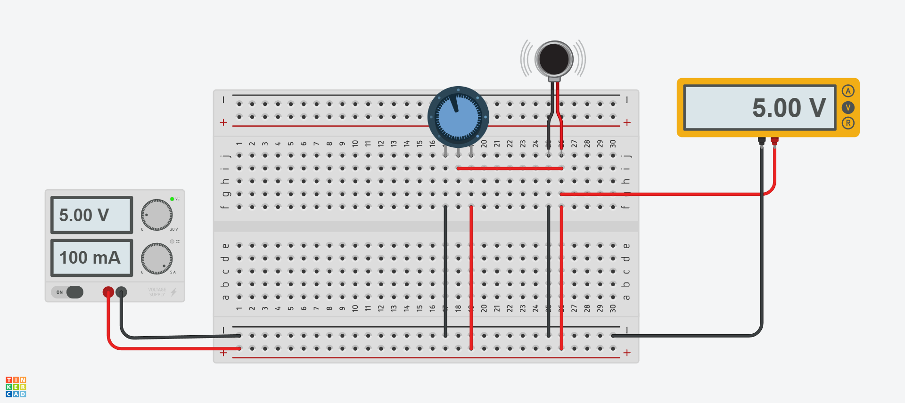

## Micro Servo
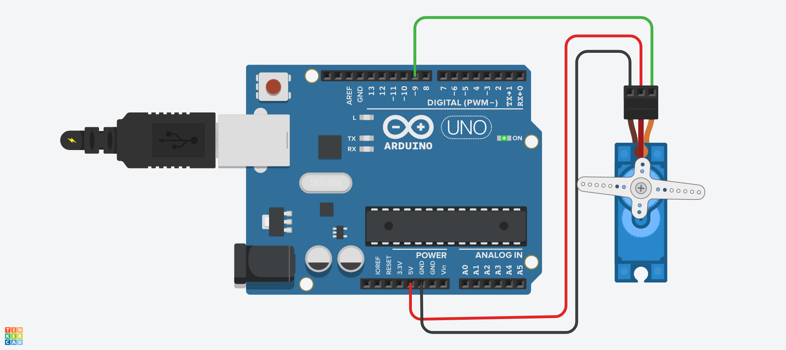
```c
/*
  Sweep
  by BARRAGAN <http://barraganstudio.com>
  This example code is in the public domain.
  modified 8 Nov 2013  by Scott Fitzgerald
  http://www.arduino.cc/en/Tutorial/Sweep
*/
#include <Servo.h> // 서보 모터 제어용 라이브러리 포함

int pos = 0;         // 서보 위치값 저장 변수
Servo servo_9;       // 서보 객체 생성 (핀 9번 사용)

void setup() {
  servo_9.attach(9, 500, 2500); // 서보 핀 9번에 연결, 펄스 폭 범위 설정
}

void loop() {
  // 서보를 0도부터 180도까지 1도씩 증가시키며 이동
  for (pos = 0; pos <= 180; pos += 1) {
    servo_9.write(pos);   // 현재 pos 각도로 서보 회전
    delay(15);            // 15밀리초 대기 (서보가 움직일 시간 확보)
  }

  // 서보를 180도부터 0도까지 1도씩 감소시키며 이동
  for (pos = 180; pos >= 0; pos -= 1) {
    servo_9.write(pos);   // 현재 pos 각도로 서보 회전
    delay(15);            // 15밀리초 대기
  }
}
```
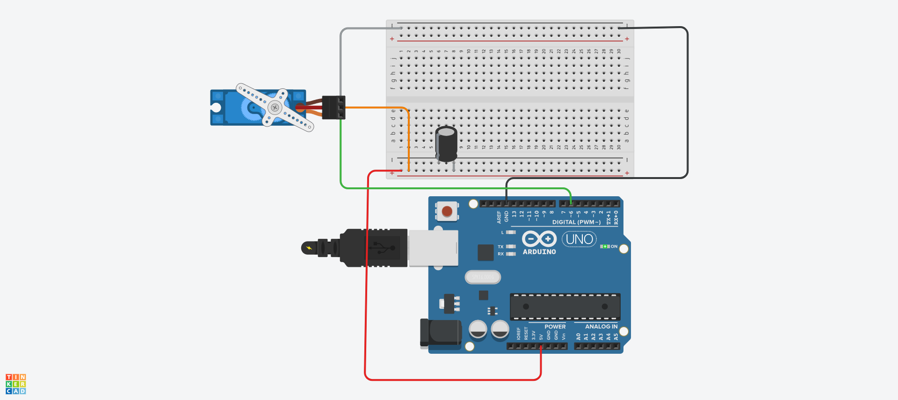
```c
#include <Servo.h> // Servo 라이브러리 사용

Servo myservo; // 서보 모터 객체 생성 (myservo라는 이름으로)

void setup(){
  myservo.attach(6); // 서보 모터를 Arduino의 D6번 핀에 연결
}

void loop(){
  // 서보를 시계 방향으로 0도에서 180도까지 회전
  for(int ang = 0; ang < 180; ang++) {
    myservo.write(ang);   // 현재 각도로 서보 회전
    delay(50);            // 0.05초 대기 (회전 동작 시간 확보)
  }

  // 서보를 반시계 방향으로 180도에서 0도까지 회전
  for(int ang = 180; ang > 0; ang--) {
    myservo.write(ang);   // 현재 각도로 서보 회전
    delay(50);            // 0.05초 대기
  }
}
```
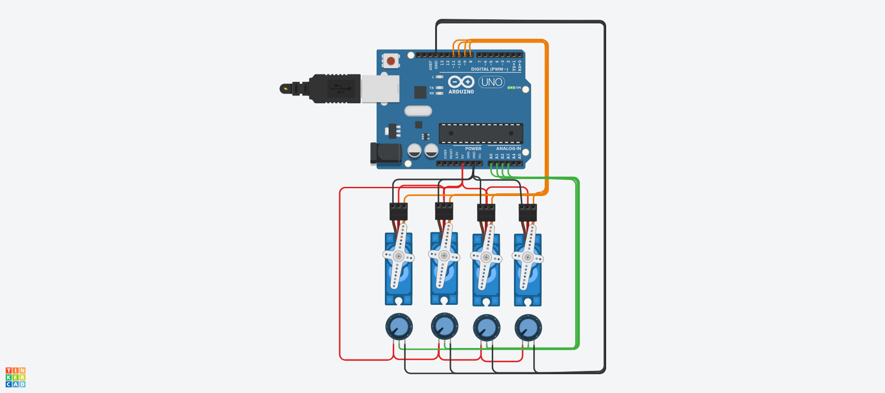
```c
#include <Servo.h> // 서보 모터 제어를 위한 라이브러리

// 서보 객체 생성 (각각의 핀에 서보 모터 연결)
Servo servo_5;
Servo servo_4;
Servo servo_3;
Servo servo_2;

void setup()
{
  pinMode(A3, INPUT);     // A3 핀을 입력으로 설정 (가변저항)
  servo_5.attach(11);     // 서보_5를 D11번 핀에 연결

  pinMode(A2, INPUT);     
  servo_4.attach(10);     // 서보_4를 D10번 핀에 연결

  pinMode(A1, INPUT);     
  servo_3.attach(9);      // 서보_3를 D9번 핀에 연결

  pinMode(A0, INPUT);     
  servo_2.attach(8);      // 서보_2를 D8번 핀에 연결
}

void loop()
{
  // 아날로그 입력값(0~1023)을 0~180도로 변환하여 서보에 전달
  servo_5.write(map(analogRead(A3), 0, 1023, 0, 180)); 
  servo_4.write(map(analogRead(A2), 0, 1023, 0, 180));
  servo_3.write(map(analogRead(A1), 0, 1023, 0, 180));
  servo_2.write(map(analogRead(A0), 0, 1023, 0, 180));

  delay(10); // 너무 빠른 연산으로 시뮬레이션이 느려지는 것을 방지
}
```
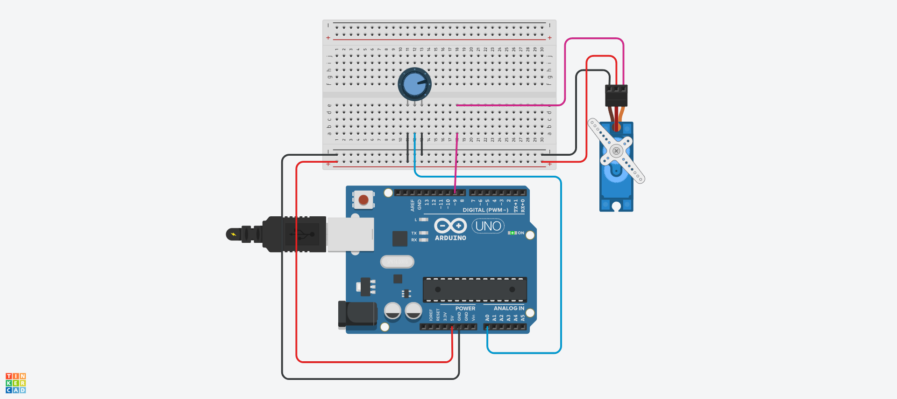
```c
#include <Servo.h>             // 서보 모터 제어를 위한 라이브러리 포함

Servo servoMotor;              // 서보 객체 생성 (이름: servoMotor)
int potPos;                    // 가변저항 값을 저장할 변수

void setup() {
  servoMotor.attach(9);        // 서보 모터 신호선을 Arduino 9번 핀에 연결
}

void loop() {
  potPos = map(analogRead(A0), 0, 1023, 0, 180);  // A0 핀에서 가변저항 값 읽어 0~180도로 변환
  servoMotor.write(potPos);                        // 변환된 각도로 서보 모터 회전 명령
  delay(15);                                       // 15ms 대기 (서보가 움직일 시간 확보)
}

```
## Hobby Gearmotor
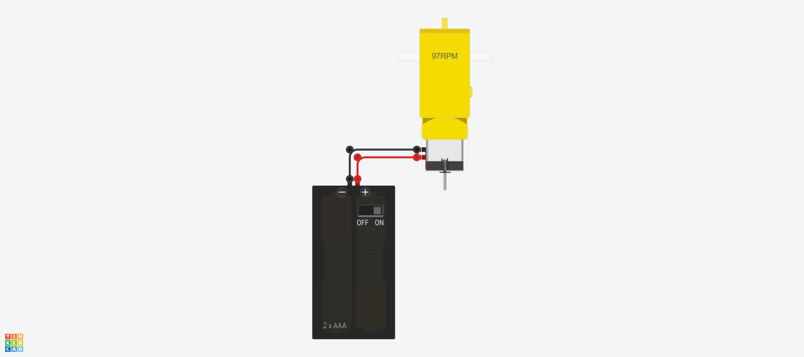

## 7-segment display(ca): Count Down Alarm

```c
int index = 0;       // LED 핀 인덱스용 변수
int counter;         // 루프 카운터 변수

// 숫자 0~9를 나타내는 LED ON/OFF 패턴 (8비트 문자열)
String pattern[] = {
  "00100001",   // 0
  "11111001",   // 1
  "00010011",   // 2
  "01010001",   // 3
  "11001001",   // 4
  "01000101",   // 5
  "00000105",   // 6
  "11110001",   // 7
  "00000001",   // 8
  "01000001"    // 9
};

// 모든 LED를 꺼주는 함수
void clear() {
  index = 0;
  for (counter = 0; counter < 8; ++counter) {
    analogWrite(index + 2, 255);  // 밝기를 최대 → OFF로 간주
    index++;
  }
}

// 숫자를 받아서 해당 숫자 패턴으로 LED를 표시
void display(int num) {
  clear();  // 먼저 LED 초기화
  index = 0;
  for (counter = 0; counter < 8; ++counter) {
    if (pattern[num].substring(index, index + 1) == "0") {
      analogWrite(index + 2, 0);   // 해당 자리가 0이면 LED 켜기
    }
    index++;
  }
}

void setup() {
  // 2~9번 핀을 출력으로 설정 (총 8개의 LED 제어)
  pinMode(2, OUTPUT);
  pinMode(3, OUTPUT);
  pinMode(4, OUTPUT);
  pinMode(5, OUTPUT);
  pinMode(6, OUTPUT);
  pinMode(7, OUTPUT);
  pinMode(8, OUTPUT);
  pinMode(9, OUTPUT);

  // 숫자 9부터 0까지 1초씩 표시
  display(9); delay(1000);
  display(8); delay(1000);
  display(7); delay(1000);
  display(6); delay(1000);
  display(5); delay(1000);
  display(4); delay(1000);
  display(3); delay(1000);
  display(2); delay(1000);
  display(1); delay(1000);
  display(0); delay(1000);

  // 마지막에 소리 재생 (도 음, 523Hz, 0.5초)
  tone(10, 523, 500);
}

void loop() {
  // 반복 동작 없음
}

```

## MISA 7-Segment 4-Digit LED Display
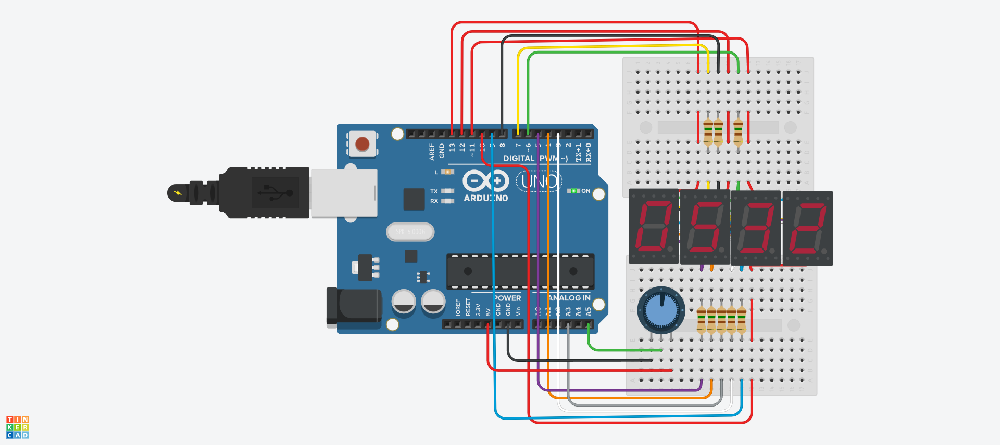
```c
/* 6-13-2011  Spark Fun Electronics 2011  -- Nathan Seidle */

// 4자리 7-세그먼트 공통 애노드(또는 캐소드) 디스플레이 제어용 핀 설정
int digit1 = 13; // 첫 번째 자리 제어 핀
int digit2 = 12; // 두 번째 자리 제어 핀
int digit3 = 11; // 세 번째 자리 제어 핀
int digit4 = 10; // 네 번째 자리 제어 핀

// 7-세그먼트 각 세그먼트 핀 매핑
int segA = 7;  // 세그먼트 A
int segB = 6;  // 세그먼트 B
int segC = 3;  // 세그먼트 C
int segD = 4;  // 세그먼트 D
int segE = 5;  // 세그먼트 E
int segF = 8;  // 세그먼트 F
int segG = 9;  // 세그먼트 G
int segDP = 2; // 소수점 세그먼트 (사용 안 함)

void setup() {                
  // 세그먼트 핀들을 출력으로 설정
  pinMode(segA, OUTPUT);
  pinMode(segB, OUTPUT);
  pinMode(segC, OUTPUT);
  pinMode(segD, OUTPUT);
  pinMode(segE, OUTPUT);
  pinMode(segF, OUTPUT);
  pinMode(segG, OUTPUT);

  // 자리 선택 핀들을 출력으로 설정
  pinMode(digit1, OUTPUT);
  pinMode(digit2, OUTPUT);
  pinMode(digit3, OUTPUT);
  pinMode(digit4, OUTPUT);

  pinMode(13, OUTPUT);  // 내장 LED (사용하지 않음)
}

void loop() 
{
  // 아날로그 입력 A5핀(=5)에서 값을 읽어 7-세그먼트에 표시
  displayNumber( analogRead(5) );
}

void displayNumber(int toDisplay) {
  #define DISPLAY_BRIGHTNESS  500  // 각 자리 표시 시간(마이크로초)

  #define DIGIT_ON  HIGH   // 자리 선택 핀 켜기
  #define DIGIT_OFF  LOW   // 자리 선택 핀 끄기

  long beginTime = millis();

  // 4자리 각각을 빠르게 반복해서 켜서 숫자 표시 (다중화)
  for(int digit = 4 ; digit > 0 ; digit--) {

    // 현재 자리 켜기
    switch(digit) {
      case 1:
        digitalWrite(digit1, DIGIT_ON);
        break;
      case 2:
        digitalWrite(digit2, DIGIT_ON);
        break;
      case 3:
        digitalWrite(digit3, DIGIT_ON);
        break;
      case 4:
        digitalWrite(digit4, DIGIT_ON);
        break;
    }

    // toDisplay의 마지막 자리 숫자를 표시 (0~9)
    lightNumber(toDisplay % 10);

    // 표시할 숫자에서 마지막 자리 제거
    toDisplay /= 10;

    // 현재 자리 표시 유지 (지연시간, 밝기 조절용)
    delayMicroseconds(DISPLAY_BRIGHTNESS);

    // 모든 세그먼트 끄기
    lightNumber(10);

    // 모든 자리 끄기
    digitalWrite(digit1, DIGIT_OFF);
    digitalWrite(digit2, DIGIT_OFF);
    digitalWrite(digit3, DIGIT_OFF);
    digitalWrite(digit4, DIGIT_OFF);
  }

  // 약 10ms 동안 대기해서 화면 깜빡임 방지
  while( (millis() - beginTime) < 10) ;
}

// 숫자에 따라 7-세그먼트 각 세그먼트 켜기/끄기
// numberToDisplay가 10이면 모두 끄기
void lightNumber(int numberToDisplay) {

  #define SEGMENT_ON  LOW    // 세그먼트 켜기 (공통 애노드일 경우 LOW)
  #define SEGMENT_OFF HIGH   // 세그먼트 끄기

  switch (numberToDisplay){

    case 0:
      digitalWrite(segA, SEGMENT_ON);
      digitalWrite(segB, SEGMENT_ON);
      digitalWrite(segC, SEGMENT_ON);
      digitalWrite(segD, SEGMENT_ON);
      digitalWrite(segE, SEGMENT_ON);
      digitalWrite(segF, SEGMENT_ON);
      digitalWrite(segG, SEGMENT_OFF);
      break;

    case 1:
      digitalWrite(segA, SEGMENT_OFF);
      digitalWrite(segB, SEGMENT_ON);
      digitalWrite(segC, SEGMENT_ON);
      digitalWrite(segD, SEGMENT_OFF);
      digitalWrite(segE, SEGMENT_OFF);
      digitalWrite(segF, SEGMENT_OFF);
      digitalWrite(segG, SEGMENT_OFF);
      break;

    case 2:
      digitalWrite(segA, SEGMENT_ON);
      digitalWrite(segB, SEGMENT_ON);
      digitalWrite(segC, SEGMENT_OFF);
      digitalWrite(segD, SEGMENT_ON);
      digitalWrite(segE, SEGMENT_ON);
      digitalWrite(segF, SEGMENT_OFF);
      digitalWrite(segG, SEGMENT_ON);
      break;

    case 3:
      digitalWrite(segA, SEGMENT_ON);
      digitalWrite(segB, SEGMENT_ON);
      digitalWrite(segC, SEGMENT_ON);
      digitalWrite(segD, SEGMENT_ON);
      digitalWrite(segE, SEGMENT_OFF);
      digitalWrite(segF, SEGMENT_OFF);
      digitalWrite(segG, SEGMENT_ON);
      break;

    case 4:
      digitalWrite(segA, SEGMENT_OFF);
      digitalWrite(segB, SEGMENT_ON);
      digitalWrite(segC, SEGMENT_ON);
      digitalWrite(segD, SEGMENT_OFF);
      digitalWrite(segE, SEGMENT_OFF);
      digitalWrite(segF, SEGMENT_ON);
      digitalWrite(segG, SEGMENT_ON);
      break;

    case 5:
      digitalWrite(segA, SEGMENT_ON);
      digitalWrite(segB, SEGMENT_OFF);
      digitalWrite(segC, SEGMENT_ON);
      digitalWrite(segD, SEGMENT_ON);
      digitalWrite(segE, SEGMENT_OFF);
      digitalWrite(segF, SEGMENT_ON);
      digitalWrite(segG, SEGMENT_ON);
      break;

    case 6:
      digitalWrite(segA, SEGMENT_ON);
      digitalWrite(segB, SEGMENT_OFF);
      digitalWrite(segC, SEGMENT_ON);
      digitalWrite(segD, SEGMENT_ON);
      digitalWrite(segE, SEGMENT_ON);
      digitalWrite(segF, SEGMENT_ON);
      digitalWrite(segG, SEGMENT_ON);
      break;

    case 7:
      digitalWrite(segA, SEGMENT_ON);
      digitalWrite(segB, SEGMENT_ON);
      digitalWrite(segC, SEGMENT_ON);
      digitalWrite(segD, SEGMENT_OFF);
      digitalWrite(segE, SEGMENT_OFF);
      digitalWrite(segF, SEGMENT_OFF);
      digitalWrite(segG, SEGMENT_OFF);
      break;

    case 8:
      digitalWrite(segA, SEGMENT_ON);
      digitalWrite(segB, SEGMENT_ON);
      digitalWrite(segC, SEGMENT_ON);
      digitalWrite(segD, SEGMENT_ON);
      digitalWrite(segE, SEGMENT_ON);
      digitalWrite(segF, SEGMENT_ON);
      digitalWrite(segG, SEGMENT_ON);
      break;

    case 9:
      digitalWrite(segA, SEGMENT_ON);
      digitalWrite(segB, SEGMENT_ON);
      digitalWrite(segC, SEGMENT_ON);
      digitalWrite(segD, SEGMENT_ON);
      digitalWrite(segE, SEGMENT_OFF);
      digitalWrite(segF, SEGMENT_ON);
      digitalWrite(segG, SEGMENT_ON);
      break;

    case 10:  // 숫자 끄기 (모든 세그먼트 끄기)
      digitalWrite(segA, SEGMENT_OFF);
      digitalWrite(segB, SEGMENT_OFF);
      digitalWrite(segC, SEGMENT_OFF);
      digitalWrite(segD, SEGMENT_OFF);
      digitalWrite(segE, SEGMENT_OFF);
      digitalWrite(segF, SEGMENT_OFF);
      digitalWrite(segG, SEGMENT_OFF);
      break;
  }
}

```


